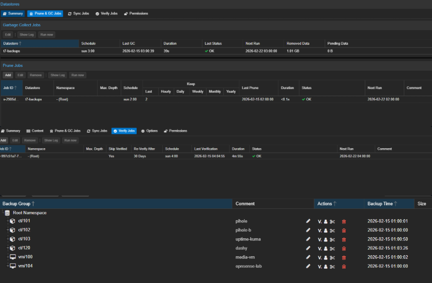

# Retention Strategy: Centralized on PBS

## Decision

Retention is managed centrally on PBS rather than through the Proxmox backup job.

This keeps retention logic in one place and avoids a permission-related failure state that surfaced during initial setup.

---

## Background

During initial configuration, backup jobs were reporting failure despite data transferring to PBS successfully.

The root cause was post-backup prune behavior being triggered from the Proxmox side. The backup upload itself worked, but the prune step was failing on permissions, which caused the overall job to report as failed.

The fix was straightforward: disable pruning from the Proxmox job and let PBS own retention entirely.

---

## Current Approach

- Proxmox backup jobs handle transfer only
- No pruning is configured on the Proxmox backup job
- Retention, pruning, and garbage collection are handled by scheduled PBS maintenance jobs
- PBS remains the centralized retention point after migration to the Management / Servers VLAN

Maintenance jobs are documented in [PBS maintenance jobs](04-pbs-maintenance-jobs.md).

---

## Post-Cutover Note

After the OPNsense VLAN cutover, PBS was validated on the Management / Servers VLAN.

This did not change the retention model. Proxmox still sends backups to PBS, and PBS still owns retention, pruning, garbage collection, and verification.

---

