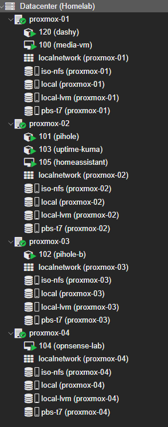

# Proxmox Storage Definitions

## Goal

Keep cluster storage consistent: per-node guest storage using LVM-thin, centralized backups on PBS, and a shared ISO library to avoid repeated uploads across nodes.

---

## Storage definitions

| ID | Type | Scope | Details |
|---|---|---|---|
| `local` | Directory | Per-node | `/var/lib/vz` — ISOs, snippets, templates |
| `local-lvm` | LVM-thin | Per-node | Thinpool `data` in VG `pve` — guest disks |
| `iso-nfs` | NFS | Shared | ISO library hosted on PBS — upload once, available cluster-wide |
| `pbs-t7` | PBS | Shared | Backup target — datastore `t7-backups` |

---

## Design notes

The two shared storage definitions (`iso-nfs` and `pbs-t7`) do the most work operationally. Hosting ISOs on PBS over NFS means a new image uploaded once is immediately available for provisioning on any node — no per-node transfers. PBS as the backup target centralizes retention, garbage collection, and integrity verification rather than scattering those concerns across individual nodes.

