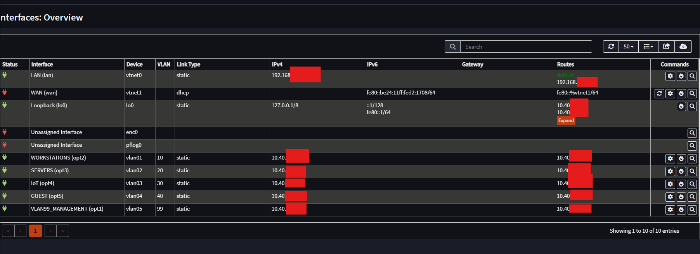
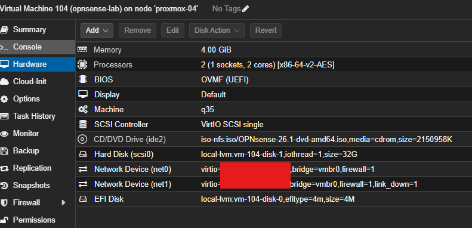

# Environment and Staging Approach

## Goal

Stage a complete VLAN segmentation design in OPNsense before the managed switch and APs are purchased or connected. When the hardware arrives, cutover should be a controlled transition — the design work is already done and validated in the VM.

---

## Staging environment

OPNsense runs as a VM in Proxmox (`opnsense-lab`, VM 104 on `proxmox-04`) with two virtual NICs:

| Interface | Role | Notes |
|---|---|---|
| `vtnet0` | LAN (trunk parent) | Intended trunk to the future managed switch — carries VLANs 10/20/30/40/99 |
| `vtnet1` | WAN | Intended uplink to ISP router — kept down during staging to avoid impacting the live LAN |

WAN was intentionally left down throughout staging. There was no reason to route traffic through the VM while the design was being built out.

---

## Why VLAN interfaces don't require additional physical ports

All five VLAN interfaces (Workstations, Servers, IoT, Guest, Management) are logical interfaces carried over a single trunk on `vtnet0`. Only WAN requires a second physical NIC. When this moves to dedicated hardware, a two-NIC machine is sufficient — one trunk port, one WAN uplink.

---

## Screenshots

