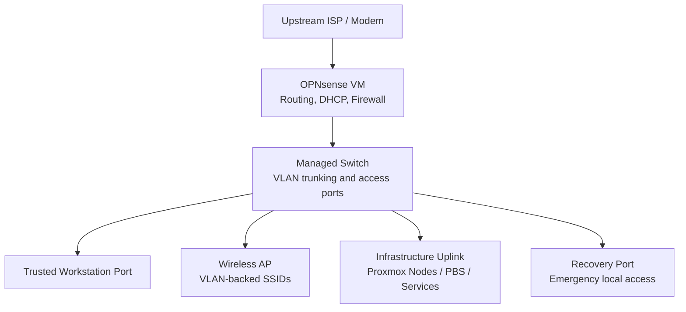

# Final Topology and VLAN Design

## Overview

This page documents the final topology after the OPNsense cutover. The environment now runs behind OPNsense with VLAN segmentation, managed switching, and VLAN-backed wireless networks. The original staged design was adjusted during implementation because some infrastructure still sits behind an unmanaged switch. That hardware limitation affected how server workloads could be placed during this phase.

Full IP addresses, MAC addresses, WAN details, and device-specific identifiers are intentionally redacted throughout.

---

## High-Level Topology

- OPNsense acts as the router, firewall, DHCP service, and inter-VLAN control point
- The managed switch carries tagged VLAN traffic where needed
- The wireless AP broadcasts SSIDs mapped to VLANs
- Proxmox infrastructure and services currently sit behind the infrastructure uplink
- A dedicated recovery path remains available for local troubleshooting

---

## Physical Design

OPNsense runs as a VM on a Proxmox host with separate connectivity for the WAN/uplink side and the LAN/trunk side toward the managed switch.

The managed switch provides:

- A trunk/uplink path back to OPNsense
- An access port for a trusted workstation
- A trunk port for the wireless AP
- An infrastructure uplink toward Proxmox and supporting services
- A recovery/emergency access port

The wireless AP is managed through Omada and broadcasts wireless networks mapped to the appropriate VLANs.

---

## VLAN Roles

| VLAN Role | Current Purpose |
|---|---|
| Workstations | Trusted client devices and main administrative workstation access |
| IoT | Smart TVs, wireless test clients, and future camera/IoT devices |
| Guest | Guest wireless access with restricted internal reachability |
| Management / Servers | Proxmox nodes, infrastructure management, monitoring, controller services, and current server workloads |
| Servers | Present in the staged configuration, not currently the active server placement model |

The addressing design uses private RFC1918 space with a consistent VLAN-to-subnet pattern. Full subnet values are redacted.

---

## Wireless VLAN Design

The wireless AP is adopted into Omada and broadcasts SSIDs mapped to separate VLAN roles.

| Wireless Role | VLAN Role | Purpose |
|---|---|---|
| Workstation wireless | Workstations | Trusted wireless clients |
| IoT wireless | IoT | Smart TVs, test clients, and future IoT devices |
| Guest wireless | Guest | Isolated guest access |

Wireless clients land in the correct security zone without needing separate physical networks. The workstation and IoT wireless networks have been validated with live client devices.

---

## Switch Port Role Summary

Exact live port mappings are intentionally generalized. The important point is the role of each switch connection.

| Switch Role | VLAN Behavior | Purpose |
|---|---|---|
| OPNsense uplink | Tagged trunk | Carries VLAN traffic between OPNsense and the managed switch |
| Workstation access | Untagged access VLAN | Places the trusted workstation into the workstation VLAN |
| Wireless AP trunk | Tagged VLANs for SSIDs | Carries workstation, IoT, and guest VLANs to the AP |
| Infrastructure uplink | Untagged management/server VLAN, plus transitional tags where needed | Connects Proxmox nodes, PBS, and supporting services |
| Recovery port | Untagged default/recovery network | Provides emergency access if switch or management configuration breaks |

---

## Design Change: Server VLAN Deferred

The original staged design included a dedicated server VLAN. During implementation this was deferred.

Several Proxmox nodes and supporting services remained connected behind an unmanaged switch. Because that switch cannot pass tagged VLANs, all devices behind it had to share the same untagged VLAN. Splitting those hosts into a separate server VLAN would have required additional managed switch ports, direct cabling changes, or different switching hardware.

To keep the cutover stable, management and server workloads were consolidated into the management/server VLAN for this phase. This preserved access to:

- Proxmox nodes
- Proxmox Backup Server
- Monitoring services
- Omada Controller
- Pi-hole DNS
- Media services and other migrated workloads

The dedicated server VLAN remains staged for future use when the physical switching layer can support it cleanly.

---

## Current Infrastructure Placement

| Service Group | VLAN Placement |
|---|---|
| Proxmox nodes | Management / Servers |
| Proxmox Backup Server | Management / Servers |
| Pi-hole DNS instances | Management / Servers |
| Omada Controller | Management / Servers |
| Uptime Kuma | Management / Servers |
| Dashy | Management / Servers |
| Media server / Jellyfin | Management / Servers |
| Home Assistant | Management / Servers |

---

## Temporary Omada Management Path

A temporary management/adoption path remains in place for Omada. The managed switch and AP were adopted through the default management path during recovery. The switch is reachable through the intended management VLAN, but Omada still identifies it through the temporary/default path.

This is a controlled transitional state, not the intended long-term management model.

This path is intentionally left in place until the switch and AP can be safely moved without risking another management lockout. It should not be removed until:

- The switch remains reachable from the intended management VLAN
- The AP remains reachable from the intended management VLAN
- Omada can manage both devices without relying on the temporary path
- A recovery method is confirmed before making the change

---

## Traffic Control Design

OPNsense controls all traffic between VLANs. The intended policy model is:

- Workstations can reach required management and service ports
- IoT can reach only explicitly allowed internal services
- Guest clients cannot reach internal infrastructure
- Management/server access is restricted to required administrative paths
- DNS is centralized through Pi-hole
- NTP is centralized through OPNsense
- Inter-VLAN access is blocked unless explicitly allowed

---

## Future Topology Improvements

The current design is operational. Planned improvements include:

- Reintroducing the dedicated server VLAN when the switching layer supports it
- Moving switch and AP management fully onto the intended management VLAN
- Removing the temporary Omada adoption path
- Replacing or bypassing the unmanaged switch where needed
- Moving workloads out of the management/server VLAN where isolation provides a clear benefit
- Further reducing broad transitional firewall rules
- Expanding IoT/camera segmentation once those devices are added

These are tracked as hardening and design maturation tasks, not blockers for the current cutover.

---

## Status

The final topology is operational. OPNsense is routing the environment, VLAN segmentation is active, the managed switch and wireless AP are adopted into Omada, wireless networks are mapped to VLANs, and core infrastructure services have been migrated or updated. The current topology reflects a practical implementation based on available hardware, with a clear path for future improvements.
