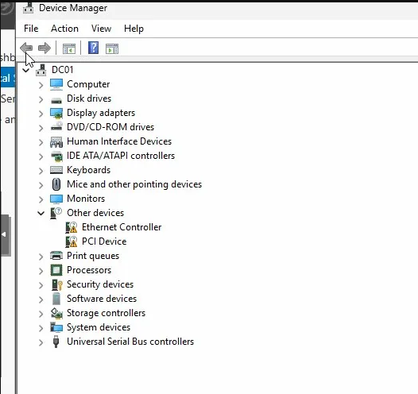

# Phase 2 - Pre-Promotion Configuration

## Overview

Before installing any roles, three things needed to be in place: a proper hostname, a working network adapter, and a static IP. All of this has to be done before AD DS promotion. DNS breaks if the DC's address changes after the fact, and clients need a fixed target for name resolution.

---

## Hostname

Renamed from the default (`WIN-URE8TQEABMG`) to `DC01` via Server Manager > Local Server > Computer Name. Reboot required and completed.

---

## Network - VirtIO Driver

After the rename, the Ethernet adapter wasn't showing up. The VirtIO NIC driver wasn't installed, only the storage driver had been loaded during OS setup.

**Fix:**
- Opened Device Manager, located the unrecognized adapter
- Used Update Driver and pointed it at the mounted VirtIO ISO
- Adapter came up as Red Hat VirtIO Ethernet Adapter




---

## Static IP Assignment

Verified `192.168.40.x` was free using a network scanner before assigning it.

| Setting | Value |
|---|---|
| IP Address | `192.168.40.x` |
| Subnet Mask | `255.255.255.0` |
| Default Gateway | `192.168.40.x` |
| Preferred DNS | `192.168.40.x` |

DNS points to itself, which is required for AD DS. `127.0.0.1` was intentionally avoided, AD best practice is to use the adapter's own static IP for the DNS entry, not the loopback address.


---

## Snapshot

Proxmox snapshot taken of VM 107 (DC01), labelled `pre-AD-promotion-clean`, before any role installation.

---

## Verified With

```powershell
Get-NetIPConfiguration
```

---

## Next Steps

1. Install AD DS role via Server Manager
2. Promote to domain controller, create new forest `exodus.lab`
3. Validate DNS forward/reverse lookup zones created automatically
4. Snapshot post-promotion baseline
