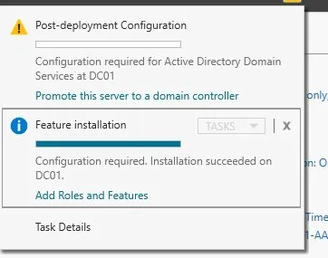
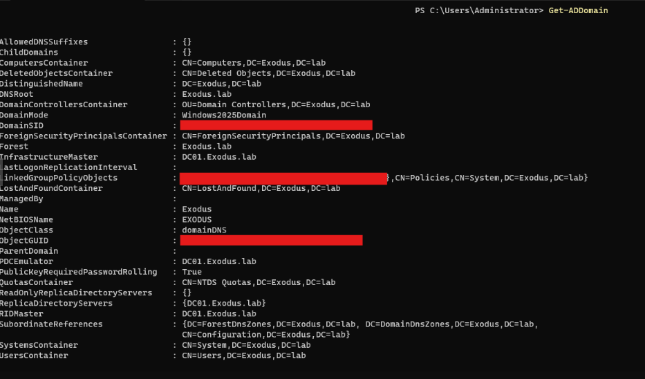
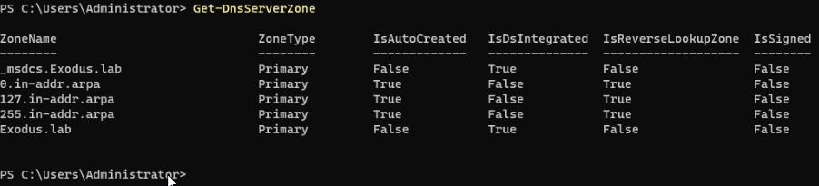
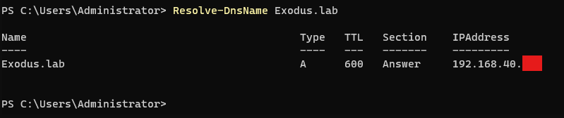

# Phase 3 - AD DS Installation & Domain Promotion

## Overview

With the hostname set and static IP in place, the AD DS role was installed and DC01 was promoted to domain controller. This is the core of the lab, everything else builds on top of it.

---

## Role Installation

Installed the Active Directory Domain Services role via Server Manager > Add Roles and Features. No errors during installation.

---

## Domain Promotion

Promoted DC01 using the AD DS Configuration Wizard with the following settings:

| Setting | Value |
|---|---|
| Deployment Operation | Add a new forest |
| Root Domain Name | `exodus.lab` |
| Forest Functional Level | Windows Server 2025 |
| Domain Functional Level | Windows Server 2025 |
| DNS Server | Yes |
| Global Catalog | Yes |
| NetBIOS Name | `EXODUS` |
| Database Path | `C:\Windows\NTDS` |
| Log Files Path | `C:\Windows\NTDS` |
| SYSVOL Path | `C:\Windows\SYSVOL` |
| DSRM Password | Set, stored securely, not documented here |

The DNS delegation warning on the DNS Options screen is expected and harmless. No parent zone exists for an internal forest.

---

## Validation

Confirmed domain promotion successful:

```powershell
Get-ADDomain
```

- Domain: `exodus.lab` ✓
- NetBIOS: `EXODUS` ✓
- Domain Mode: `Windows2025Domain` ✓
- PDC Emulator: `DC01.exodus.lab` ✓
- RID Master: `DC01.exodus.lab` ✓




Confirmed DNS zones created automatically:

```powershell
Get-DnsServerZone
```

- `exodus.lab`, forward lookup zone, AD integrated ✓
- `_msdcs.exodus.lab`, service records zone ✓
- Reverse lookup zones auto-created ✓



Confirmed DNS resolution:

```powershell
Resolve-DnsName exodus.lab
```

- Resolves to `192.168.40.x` ✓



---

## Snapshot

Proxmox snapshot taken of DC01, labelled `post-AD-promotion-baseline`.

---

## Next Steps

1. Design and build OU hierarchy
2. Create OUs via GUI, document PowerShell equivalent
