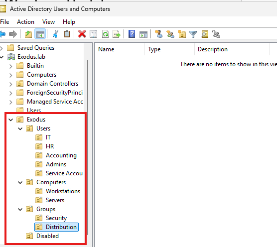

# Phase 4 - OU Structure Design

## Overview

The OU hierarchy is built to reflect how enterprise environments actually organize AD, not just a flat list of accounts. Department-level OUs under Users allow GPO targeting by team. The Disabled OU acts as a proper offboarding holding container before accounts are permanently deleted. Default system containers (Builtin, Computers, Users) were left untouched and all custom OUs were built under a separate Exodus parent.

All OUs were created with Protect from Accidental Deletion enabled.

---

## OU Hierarchy

```
exodus.lab
└── Exodus
    ├── Users
    │   ├── IT
    │   ├── HR
    │   ├── Accounting
    │   ├── Admins
    │   └── Service Accounts
    ├── Computers
    │   ├── Workstations
    │   └── Servers
    ├── Groups
    │   ├── Security
    │   └── Distribution
    └── Disabled
```



---

## Design Decisions

**Department sub-OUs under Users.** A flat Employees OU was considered and dropped. Department-level OUs allow GPO targeting by team and better reflect how enterprise environments are structured.

**Disabled OU as an offboarding container.** When a user is offboarded, their account gets disabled, stripped of group memberships, and moved here. Accounts sit in Disabled for a retention period before permanent deletion. This mirrors standard enterprise offboarding practice.

**Default containers left untouched.** Builtin, Computers, and Users are system containers and weren't modified. All custom OUs live under the Exodus parent OU instead.

---

## PowerShell Equivalents

All OUs were created via the GUI. The PowerShell equivalents are documented below as a reference for scripted deployments.

```powershell
# Create top-level parent
New-ADOrganizationalUnit -Name "Exodus" -Path "DC=Exodus,DC=lab" -ProtectedFromAccidentalDeletion $true

# Second-level OUs
New-ADOrganizationalUnit -Name "Users" -Path "OU=Exodus,DC=Exodus,DC=lab" -ProtectedFromAccidentalDeletion $true
New-ADOrganizationalUnit -Name "Computers" -Path "OU=Exodus,DC=Exodus,DC=lab" -ProtectedFromAccidentalDeletion $true
New-ADOrganizationalUnit -Name "Groups" -Path "OU=Exodus,DC=Exodus,DC=lab" -ProtectedFromAccidentalDeletion $true
New-ADOrganizationalUnit -Name "Disabled" -Path "OU=Exodus,DC=Exodus,DC=lab" -ProtectedFromAccidentalDeletion $true

# Users sub-OUs
New-ADOrganizationalUnit -Name "IT" -Path "OU=Users,OU=Exodus,DC=Exodus,DC=lab" -ProtectedFromAccidentalDeletion $true
New-ADOrganizationalUnit -Name "HR" -Path "OU=Users,OU=Exodus,DC=Exodus,DC=lab" -ProtectedFromAccidentalDeletion $true
New-ADOrganizationalUnit -Name "Accounting" -Path "OU=Users,OU=Exodus,DC=Exodus,DC=lab" -ProtectedFromAccidentalDeletion $true
New-ADOrganizationalUnit -Name "Admins" -Path "OU=Users,OU=Exodus,DC=Exodus,DC=lab" -ProtectedFromAccidentalDeletion $true
New-ADOrganizationalUnit -Name "Service Accounts" -Path "OU=Users,OU=Exodus,DC=Exodus,DC=lab" -ProtectedFromAccidentalDeletion $true

# Computers sub-OUs
New-ADOrganizationalUnit -Name "Workstations" -Path "OU=Computers,OU=Exodus,DC=Exodus,DC=lab" -ProtectedFromAccidentalDeletion $true
New-ADOrganizationalUnit -Name "Servers" -Path "OU=Computers,OU=Exodus,DC=Exodus,DC=lab" -ProtectedFromAccidentalDeletion $true

# Groups sub-OUs
New-ADOrganizationalUnit -Name "Security" -Path "OU=Groups,OU=Exodus,DC=Exodus,DC=lab" -ProtectedFromAccidentalDeletion $true
New-ADOrganizationalUnit -Name "Distribution" -Path "OU=Groups,OU=Exodus,DC=Exodus,DC=lab" -ProtectedFromAccidentalDeletion $true
```

---

## Verified With

```powershell
Get-ADOrganizationalUnit -Filter * | Select-Object Name, DistinguishedName | Sort-Object DistinguishedName
```

---

## Next Steps

1. Create standard user accounts and security groups
2. Document onboarding and offboarding procedures
3. Define naming conventions
4. Build bulk user creation script in PowerShell
****
