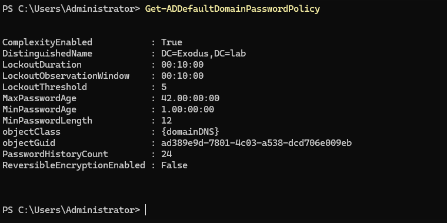
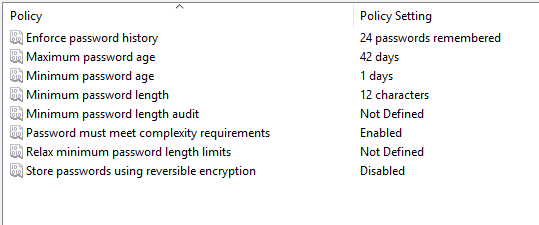
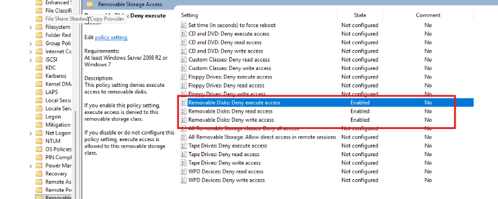
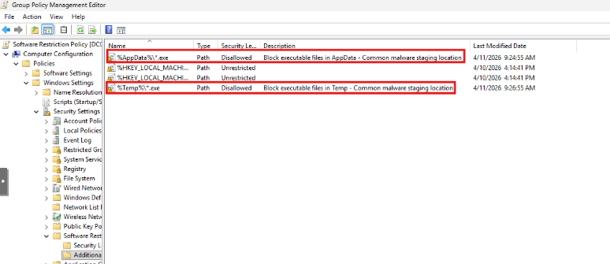
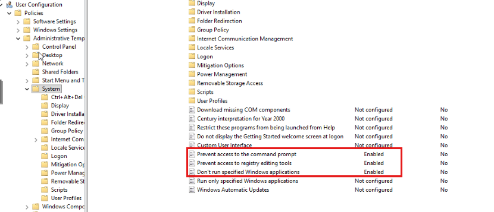
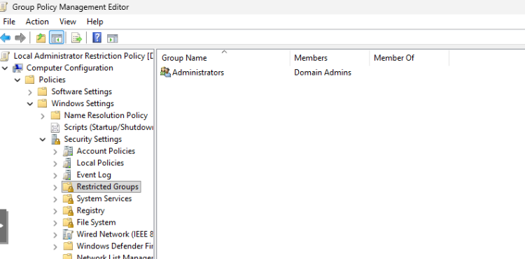
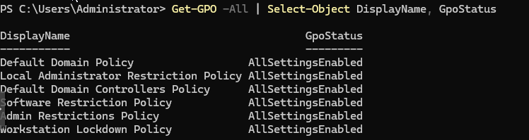
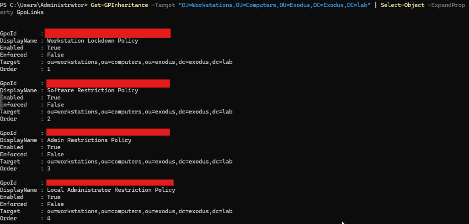

# Phase 6 - Group Policy Objects

## Overview

Four GPOs were created and linked to the Workstations OU, plus the Default Domain Policy was updated with a proper password and lockout configuration. Each GPO covers a specific area of workstation control. Settings were chosen to reflect realistic enterprise policy without breaking legitimate functionality.

---

## Password & Lockout Policy (Default Domain Policy)

Configured via the Default Domain Policy, applies domain-wide.

| Setting | Before | After |
|---|---|---|
| Minimum Password Length | 7 characters | 12 characters |
| Account Lockout Threshold | 0 (disabled) | 5 invalid attempts |
| Lockout Duration | Not defined | 10 minutes |
| Reset Lockout Counter | Not defined | 10 minutes |
| Complexity Enabled | True | True (unchanged) |
| Password History | 24 | 24 (unchanged) |
| Max Password Age | 42 days | 42 days (unchanged) |

```powershell
Get-ADDefaultDomainPasswordPolicy
```




---

## GPOs Linked to Workstations OU

All four GPOs below are linked to `OU=Workstations,OU=Computers,OU=Exodus,DC=Exodus,DC=lab`.

---

### GPO 1 - Workstation Lockdown Policy

**Screensaver / Screen Lock**

| Setting | Path | Value |
|---|---|---|
| Enable screen saver | User Config > Admin Templates > Control Panel > Personalization | Enabled |
| Screen saver timeout | User Config > Admin Templates > Control Panel > Personalization | 900 seconds (15 min) |
| Password protect screen saver | User Config > Admin Templates > Control Panel > Personalization | Enabled |

Screensaver and password protection together function as a screen lock. After 15 minutes of inactivity, users must re-authenticate.


---


**USB / Removable Storage Restrictions**

| Setting | Path | Value |
|---|---|---|
| Removable Disks: Deny read access | Computer Config > Admin Templates > System > Removable Storage Access | Enabled |
| Removable Disks: Deny write access | Computer Config > Admin Templates > System > Removable Storage Access | Enabled |




---

### GPO 2 - Software Restriction Policy

Default security level left as Unrestricted to avoid breaking legitimate software. Two targeted path rules added to block execution from common malware staging locations.

| Rule | Path | Security Level |
|---|---|---|
| Block AppData execution | `%AppData%\*.exe` | Disallowed |
| Block Temp execution | `%Temp%\*.exe` | Disallowed |


Setting the default to Disallowed without a full application whitelist risks breaking Windows components, admin tools, and user applications. Targeted rules are the safer and more practical enterprise approach.




---

### GPO 3 - Admin Restrictions Policy

Standard users are restricted from tools commonly used to bypass policy or make unauthorized system changes. Control Panel was intentionally left accessible since UAC handles privilege elevation natively for settings that require admin rights.

| Setting | Path | Value |
|---|---|---|
| Prevent access to command prompt | User Config > Admin Templates > System | Enabled (batch scripts also disabled) |
| Prevent access to registry editing tools | User Config > Admin Templates > System | Enabled (silent regedit also disabled) |
| Block PowerShell | User Config > Admin Templates > System > Don't run specified Windows applications | `powershell.exe`, `powershell_ise.exe` |




---

### GPO 4 - Local Administrator Restriction Policy

Configured via Restricted Groups to enforce that only Domain Admins are members of the local Administrators group on workstations. Any domain user previously holding local admin rights is removed when policy applies.

| Setting | Path | Value |
|---|---|---|
| Restricted Group | Computer Config > Policies > Windows Settings > Security Settings > Restricted Groups | Administrators, Members: Domain Admins only |



---

## GPO Link Verification

```powershell
# Verify all GPOs exist
Get-GPO -All | Select-Object DisplayName, GpoStatus

# Verify GPOs linked to Workstations OU
Get-GPInheritance -Target "OU=Workstations,OU=Computers,OU=Exodus,DC=Exodus,DC=lab" | Select-Object -ExpandProperty GpoLinks
```




---

## GPO Precedence (Link Order)

| Order | GPO |
|---|---|
| 1 | Workstation Lockdown Policy |
| 2 | Software Restriction Policy |
| 3 | Admin Restrictions Policy |
| 4 | Local Administrator Restriction Policy |

Lower link order number wins in the event of a conflict.

---

## Next Steps

1. Validate forward and reverse lookup zones for `exodus.lab`
2. Add static A records for lab infrastructure
3. Test DNS resolution from DC and from domain-joined client
