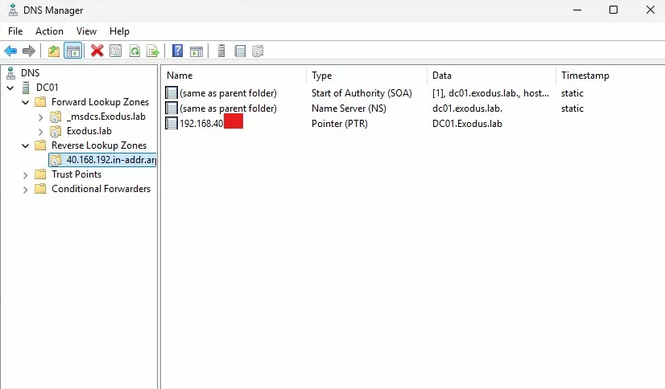
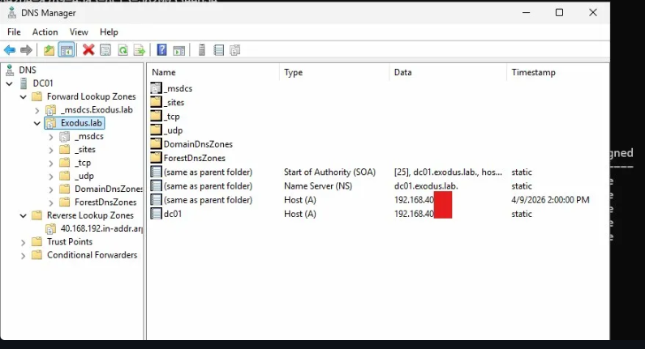
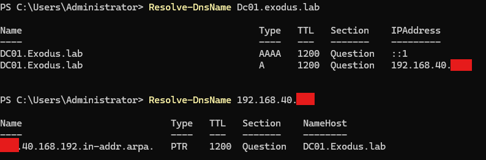

# Phase 7 - DNS Configuration

## Overview

DNS zones were created automatically during domain promotion. This phase covers the reverse lookup zone that was added manually, static record verification, and end-to-end resolution testing from the DC.

---

## Existing Zones (Auto-Created During Promotion)

| Zone | Type | AD Integrated | Notes |
|---|---|---|---|
| `Exodus.lab` | Primary | Yes | Forward lookup zone |
| `_msdcs.Exodus.lab` | Primary | Yes | Service records zone |
| `0.in-addr.arpa` | Primary | No | Auto-created default |
| `127.in-addr.arpa` | Primary | No | Auto-created default |
| `255.in-addr.arpa` | Primary | No | Auto-created default |

---

## Reverse Lookup Zone Created

Created reverse lookup zone for the `192.168.40.0/24` subnet via DNS Manager.

| Setting | Value |
|---|---|
| Zone Name | `40.168.192.in-addr.arpa` |
| Type | Active Directory-Integrated Primary |
| Replication Scope | All DNS servers in domain: Exodus.lab |
| Dynamic Updates | Secure only |

```powershell
Add-DnsServerPrimaryZone -NetworkID "192.168.40.0/24" -ReplicationScope "Domain"
```



---

## Static Records

DC01's A record was registered automatically during domain promotion. The PTR record was added manually after the reverse lookup zone was created.

| Record Type | Name | Value |
|---|---|---|
| A | `dc01.Exodus.lab` | `192.168.40.x` |
| PTR | `192.168.40.x` | `DC01.Exodus.lab` |

```powershell
Add-DnsServerResourceRecordPtr -ZoneName "40.168.192.in-addr.arpa" -Name "x" -PtrDomainName "DC01.Exodus.lab"
```


---

## Forward Lookup Zone Records (Exodus.lab)

| Name | Type | Data |
|---|---|---|
| (same as parent folder) | SOA | dc01.exodus.lab |
| (same as parent folder) | NS | dc01.exodus.lab |
| (same as parent folder) | A | 192.168.40.x |
| dc01 | A | 192.168.40.x |

---

## Validation

Both forward and reverse resolution confirmed from DC01:

```powershell
Resolve-DnsName dc01.Exodus.lab
Resolve-DnsName 192.168.40.x
```

- Forward: `DC01.Exodus.lab` resolves correctly ✓
- Reverse: `192.168.40.x` resolves to `DC01.Exodus.lab` ✓




---

## Next Steps

1. Provision CLIENT01 and CLIENT02 in VirtualBox
2. Assign static IPs and point DNS to DC01
3. Domain join both clients
4. Validate GPO application on workstations
****
