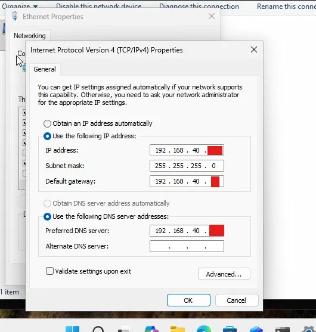
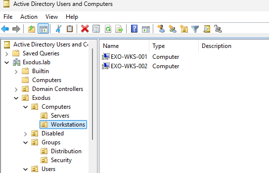
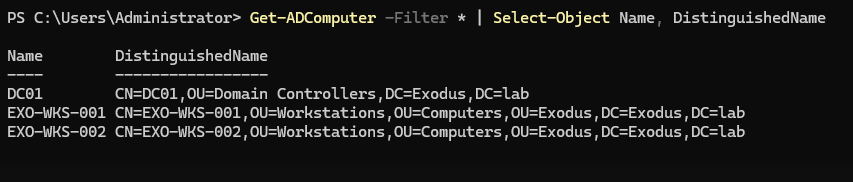
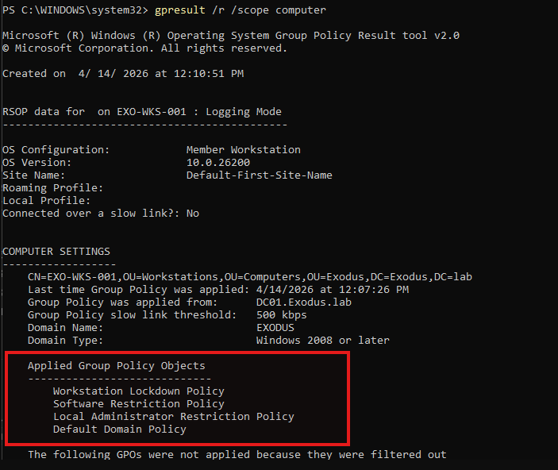
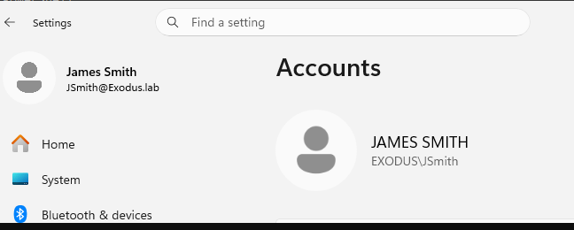

# Phase 8 - Windows 11 Client Setup & Domain Join

## Overview

Two Windows 11 workstations were provisioned in VirtualBox, assigned static IPs, and joined to `Exodus.lab`. After joining, both machines were moved from the default Computers container to the correct OU so GPOs would apply. GPO application and domain user login were both validated.

---

## VM Inventory

| VM | Host | Role |
|---|---|---|
| `EXO-WKS-001` | VirtualBox | Domain workstation |
| `EXO-WKS-002` | VirtualBox | Domain workstation |

---

## Naming Convention

Workstations follow the naming scheme `EXO-WKS-###`, domain prefix, device type, sequential number. Consistent with how enterprise environments identify workstations by site or domain prefix.

---

## Network Configuration

Both clients were assigned static IPs before domain join. DNS was pointed to DC01, which is required for domain resolution.

| Setting | EXO-WKS-001 | EXO-WKS-002 |
|---|---|---|
| IP Address | 192.168.40.x | 192.168.40.x |
| Subnet Mask | 255.255.255.0 | 255.255.255.0 |
| Gateway | 192.168.40.x | 192.168.40.x |
| DNS | 192.168.40.x (DC01) | 192.168.40.x (DC01) |


---

## Domain Join

Both workstations joined to `Exodus.lab` using Domain Administrator credentials. After joining, both computers landed in the default `CN=Computers` container and were manually moved to the Workstations OU.

New domain-joined computers always land in `CN=Computers` by default. Moving them to the correct OU is a required post-join step to ensure GPOs apply.

```powershell
Move-ADObject -Identity "CN=EXO-WKS-001,CN=Computers,DC=Exodus,DC=lab" `
              -TargetPath "OU=Workstations,OU=Computers,OU=Exodus,DC=Exodus,DC=lab"

Move-ADObject -Identity "CN=EXO-WKS-002,CN=Computers,DC=Exodus,DC=lab" `
              -TargetPath "OU=Workstations,OU=Computers,OU=Exodus,DC=Exodus,DC=lab"
```

---

## OU Placement Verified

```powershell
Get-ADComputer -Filter * | Select-Object Name, DistinguishedName
```

| Computer | OU |
|---|---|
| DC01 | OU=Domain Controllers (default, do not move) |
| EXO-WKS-001 | OU=Workstations,OU=Computers,OU=Exodus |
| EXO-WKS-002 | OU=Workstations,OU=Computers,OU=Exodus |






---

## GPO Application Verified

GPOs confirmed applying to EXO-WKS-001 via elevated `gpresult /r /scope computer`:

```
Applied Group Policy Objects
----------------------------
Workstation Lockdown Policy
Software Restriction Policy
Local Administrator Restriction Policy
Default Domain Policy
```



`Admin Restrictions Policy` contains User Configuration settings only. It applies at user logon, not computer startup, so it will not appear in computer scope results.

`Invoke-GPUpdate` remote push failed on both clients due to Remote Scheduled Tasks Management firewall rules being disabled. `gpupdate /force` was run locally on each client instead.

---

## Domain User Login Confirmed

JSmith logged into EXO-WKS-001 successfully. User is a member of `GRP_IT` and `Domain Users` as expected.



---

## Next Steps

1. Create shared folders on DC01
2. Configure NTFS and share permissions
3. Test access with different user roles
4. Map drives via GPO
