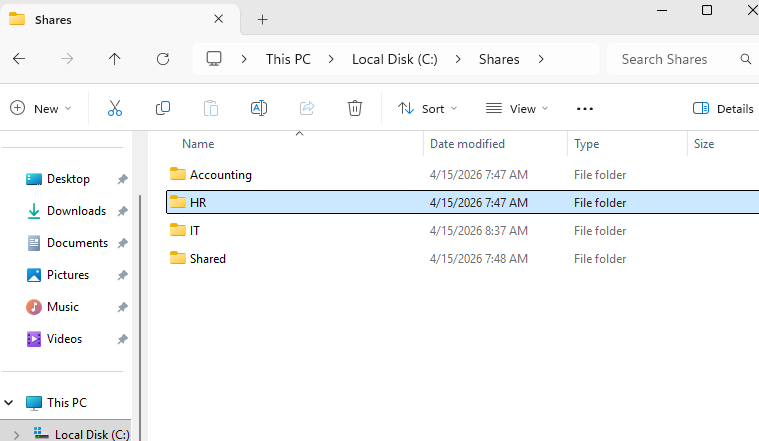
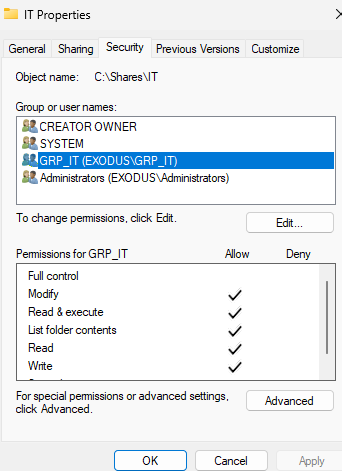
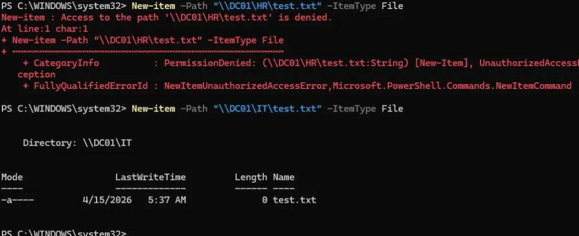

# Phase 9 - File Share Permissions

## Overview

Four department shares were created on DC01 under `C:\Shares\`. Share permissions are set broadly and NTFS permissions handle the actual access control. This is standard enterprise practice and the difference between the two layers is documented and tested below.

---

## Share Structure

| Share | Path | Access Group |
|---|---|---|
| IT | `C:\Shares\IT` | GRP_IT |
| HR | `C:\Shares\HR` | GRP_HR |
| Accounting | `C:\Shares\Accounting` | GRP_Accounting |
| Shared | `C:\Shares\Shared` | Domain Users (all staff) |




---

## Permission Model

Two layers of permissions apply to every share. Effective access is always the most restrictive combination of both.

**Share Permissions (all four shares):**

| Group | Permission |
|---|---|
| Domain Users | Full Control |
| Everyone | Removed |

Share permissions are set broadly because NTFS permissions handle the granular access control. This is standard enterprise practice.




**NTFS Permissions:**

| Share | Group | Permission |
|---|---|---|
| IT | GRP_IT | Modify |
| IT | Administrators | Full Control (inherited) |
| IT | SYSTEM | Full Control (inherited) |
| HR | GRP_HR | Modify |
| HR | Administrators | Full Control (inherited) |
| HR | SYSTEM | Full Control (inherited) |
| Accounting | GRP_Accounting | Modify |
| Accounting | Administrators | Full Control (inherited) |
| Accounting | SYSTEM | Full Control (inherited) |
| Shared | Domain Users | Modify |
| Shared | Administrators | Full Control (inherited) |
| Shared | SYSTEM | Full Control (inherited) |

Inheritance was disabled on department folders before removing the default `Users (EXODUS\Users)` entry. Inherited permissions were converted to explicit permissions first, then `Users` was removed.

---

## NTFS vs Share Permissions

| | Share Permissions | NTFS Permissions |
|---|---|---|
| Where set | Sharing tab > Advanced Sharing > Permissions | Security tab |
| Applies to | Network access only | Both local and network access |
| Granularity | Basic (Full Control, Change, Read) | Granular (Modify, Read & Execute, Write, etc.) |
| Best practice | Set broadly, let NTFS restrict | Set granularly per group |

---

## PowerShell Equivalents

```powershell
# Create folder structure
New-Item -Path "C:\Shares\IT" -ItemType Directory
New-Item -Path "C:\Shares\HR" -ItemType Directory
New-Item -Path "C:\Shares\Accounting" -ItemType Directory
New-Item -Path "C:\Shares\Shared" -ItemType Directory

# Create shares
New-SmbShare -Name "IT" -Path "C:\Shares\IT" -FullAccess "EXODUS\Domain Users"
New-SmbShare -Name "HR" -Path "C:\Shares\HR" -FullAccess "EXODUS\Domain Users"
New-SmbShare -Name "Accounting" -Path "C:\Shares\Accounting" -FullAccess "EXODUS\Domain Users"
New-SmbShare -Name "Shared" -Path "C:\Shares\Shared" -FullAccess "EXODUS\Domain Users"
```

---

## Verified With

```powershell
# Verify shares exist
Get-SmbShare | Where-Object {$_.Path -like "C:\Shares*"} | Select-Object Name, Path

# Test access as JSmith (IT user)
Test-Path \\DC01\IT        # Returns True
Test-Path \\DC01\HR        # Returns True (network reachable but NTFS blocks writes)

# Confirmed NTFS enforcement via file creation test
New-Item -Path "\\DC01\HR\test.txt" -ItemType File   # Access Denied
New-Item -Path "\\DC01\IT\test.txt" -ItemType File   # Created successfully
```

`Test-Path` only verifies network reachability, it does not validate NTFS access. Always use a file creation or read test to confirm effective permissions.




---

## Next Steps

1. Apply CIS Benchmark basics for Windows Server 2025
2. Disable unnecessary services
3. Configure Windows Firewall
4. Rename default Administrator account
5. Document all changes with before and after state
