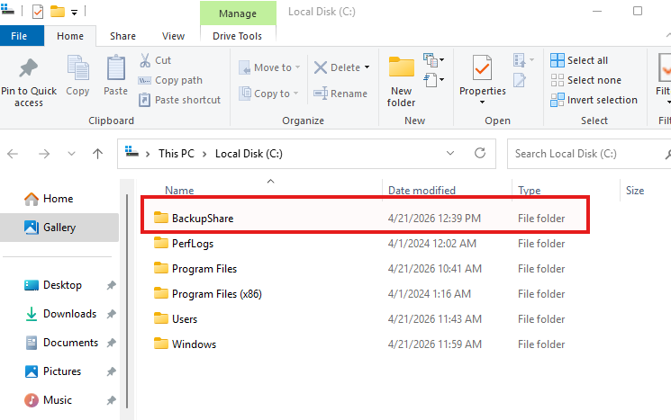
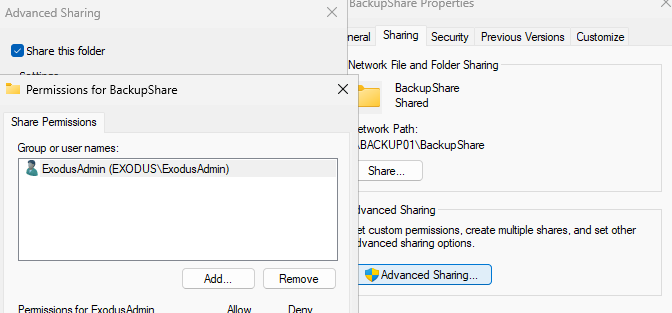
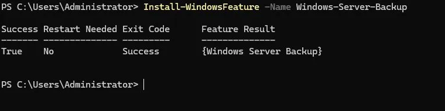
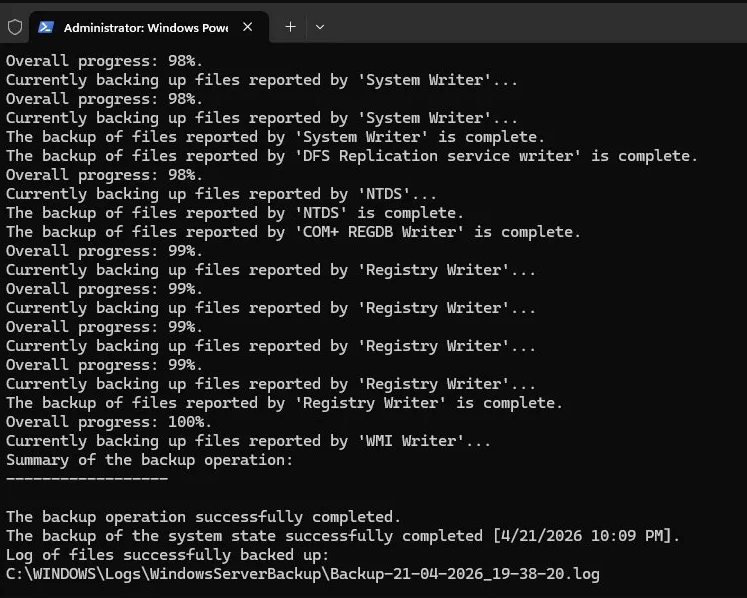
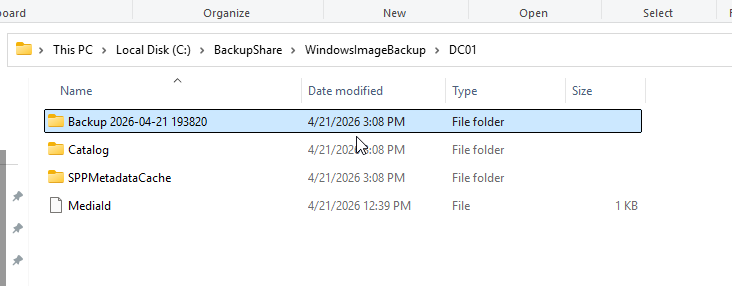
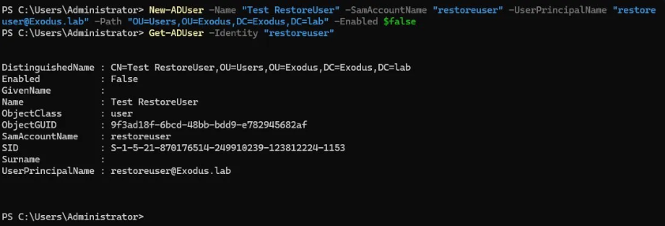
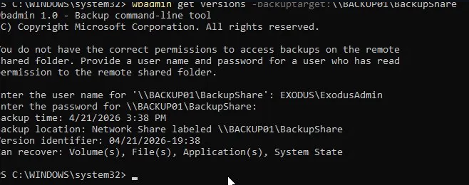

# Phase 12 - Backup and Recovery

## Overview

This phase covers System State backup and restore for DC01 using Windows Server Backup. The goal is a working backup-and-restore procedure that is validated with a real AD change, with the full process documented as a reusable runbook.

A dedicated backup server (BACKUP01) was provisioned as the backup target. This mirrors a realistic enterprise pattern where backups are written to a separate server or NAS, not to the same machine being backed up.

---

## Environment

| Setting | Value |
|---|---|
| Domain Controller | DC01 (`exodus.lab`) |
| OS | Windows Server 2025 |
| Backup Target Server | BACKUP01 |
| Backup Target Share | `\\BACKUP01\BackupShare` |
| Backup Share Path | `C:\BackupShare` on BACKUP01 |
| Backup Type | System State |
| Backup Size | 17.1 GB |

---

## BACKUP01 Configuration

BACKUP01 is a Windows Server 2025 VM provisioned specifically to receive backups from DC01. It is domain-joined to `exodus.lab` and has no other roles or features installed.

**Share permissions on `\\BACKUP01\BackupShare`:**

| Principal | Permission |
|---|---|
| EXODUS\ExodusAdmin | Full Control |

**NTFS permissions on `C:\BackupShare`:**

| Principal | Permission |
|---|---|
| EXODUS\ExodusAdmin | Full Control |
| CREATOR OWNER | Full Control (inherited default) |
| SYSTEM | Full Control (inherited default) |
| BACKUP01\Administrators | Full Control (inherited default) |

Share and NTFS permissions are aligned so ExodusAdmin can read and write backup data from DC01 over the network.




---

## Installing Windows Server Backup

Windows Server Backup is a built-in feature but is not installed by default.

**Installation via PowerShell:**

```powershell
Install-WindowsFeature -Name Windows-Server-Backup
```

The Server Manager GUI wizard can also install this feature, but it uses WinRM to validate prerequisites. Since WinRM is disabled on DC01 as part of Phase 10 security hardening, the GUI wizard reports a predeployment failure even when the installation succeeds. The PowerShell cmdlet bypasses this check entirely and is the reliable method on this DC.

**State Change:**

| Feature | Before | After |
|---|---|---|
| Windows-Server-Backup | Available | Installed |



---

## Performing a System State Backup

A System State backup on a domain controller captures the AD DS database (NTDS.dit), SYSVOL, the registry, boot files, and the COM+ class registration database. It is the minimum backup needed to restore a DC to a working state.

```powershell
wbadmin start systemstatebackup -backuptarget:\\BACKUP01\BackupShare -quiet
```

When targeting a network share, wbadmin will prompt for credentials if the current session does not have access. Provide `EXODUS\ExodusAdmin` and the account password when prompted.

A successful backup will show each VSS writer completing in sequence (System Writer, DFS Replication, NTDS, COM+ REGDB Writer, Registry Writer, WMI Writer) and finish with:

```text
The backup operation successfully completed.
The backup of the system state successfully completed [date time].
Log of files successfully backed up: C:\WINDOWS\Logs\WindowsServerBackup\Backup-[date]-[time].log
```

The backup lands on BACKUP01 at `C:\BackupShare\WindowsImageBackup\DC01\`.




---

## Authoritative vs Non-Authoritative Restore

Active Directory restores can be either authoritative or non-authoritative. The difference matters because restoring a domain controller is not only about bringing the server back online. It also affects how restored directory data behaves during replication.

A **non-authoritative restore** restores the domain controller from backup, then allows normal AD replication to update it with the latest directory data from other domain controllers. This is the default restore behavior and is normally used when recovering a failed domain controller in a multi-DC environment.

An **authoritative restore** marks selected restored AD objects as the authoritative version. Those objects then replicate outward to other domain controllers and overwrite newer replicated versions. This is used when an object was deleted or changed incorrectly and the restored version needs to become the correct copy.

This lab uses a single domain controller, so the restore performed here functions as a practical System State restore of DC01. There are no additional domain controllers to replicate newer changes back into DC01. The validation is still useful because it confirms that AD DS, SYSVOL, registry, boot files, and system state can be restored from backup.

| Restore Type | Typical Use Case |
|---|---|
| Non-authoritative restore | Recover a failed DC and let it receive current AD data from replication partners |
| Authoritative restore | Recover deleted or incorrect AD objects and force the restored version to replicate outward |

For this lab, the restore is validated by creating a test AD object after the backup, restoring from the earlier System State backup, and confirming the test object no longer exists afterward.

---

## Restore Procedure

### Prerequisites

- Windows Server Backup installed on DC01
- A completed System State backup accessible at `\\BACKUP01\BackupShare`
- The DSRM password set during domain promotion in Phase 3
- Access to the DC01 console

---

### Step 1 - Create a known AD state to validate against

Before restoring, create an AD object that did not exist at backup time. After the restore completes, this object should be gone, confirming AD was reverted to the backup state.

```powershell
New-ADUser -Name "Test RestoreUser" -SamAccountName "restoreuser" `
  -UserPrincipalName "restoreuser@Exodus.lab" `
  -Path "OU=Users,OU=Exodus,DC=Exodus,DC=lab" -Enabled $false
```

Confirm the user exists:

```powershell
Get-ADUser -Identity "restoreuser"
```



---

### Step 2 - Boot DC01 into Directory Services Restore Mode

System State restore on a DC cannot run while AD DS is online. DSRM takes the DC offline from the domain so the AD database can be overwritten safely.

```cmd
bcdedit /set safeboot dsrepair
```

Reboot DC01. It will boot into DSRM automatically.

---

### Step 3 - Log in with the DSRM local Administrator account

At the login screen, select Other user and log in as:

- Username: `.\Administrator`
- Password: the DSRM password set during domain promotion

The `.\` prefix is required to target the local account. Do not use domain credentials, the domain is offline in DSRM.

---

### Step 4 - Identify the backup version

```cmd
wbadmin get versions -backuptarget:\\BACKUP01\BackupShare
```

Enter `EXODUS\ExodusAdmin` credentials when prompted. Note the Version identifier from the output, formatted as MM/DD/YYYY-HH:MM.

Example output:

```text
Backup time: 4/21/2026 3:38 PM
Backup location: Network Share labeled \\BACKUP01\BackupShare
Version identifier: 04/21/2026-19:38
Can recover: Volume(s), File(s), Application(s), System State
```



---

### Step 5 - Run the restore

```cmd
wbadmin start systemstaterecovery -version:04/21/2026-19:38 -backuptarget:\\BACKUP01\BackupShare -quiet
```

Replace the version value with the identifier returned in Step 4. Enter `EXODUS\ExodusAdmin` credentials when prompted. The restore will run for 20-40 minutes and finish with:

```text
The system state recovery operation that started at [date time] has successfully completed.
```

DC01 will reboot automatically and the safeboot flag will be cleared by the restore process.


---

### Step 6 - Log back in and validate

After reboot, DC01 is back online as a domain controller. Log in with `EXODUS\ExodusAdmin` and verify the restore reverted AD to the backup state:

```powershell
Get-ADUser -Identity "restoreuser"
```

Expected result: an error stating the object cannot be found. The user was created after the backup was taken so it should no longer exist. This confirms the restore worked.


---

### Step 7 - Confirm the safeboot flag is cleared

```powershell
bcdedit /enum | Select-String "safeboot"
```

No output means the flag is clear and DC01 will boot normally on next restart.


---

## Notes

Windows Server Backup logs are written to `C:\WINDOWS\Logs\WindowsServerBackup\`. Each backup job creates a log file named `Backup-DD-MM-YYYY_HH-MM-SS.log`. Review this file if a backup job fails or produces warnings.

This lab uses on-demand backups only. Scheduled backups can be configured via the GUI under the Backup Schedule option in the Actions pane of wbadmin.msc.

In a production environment, backup jobs should be scheduled, logs monitored for failures, and backup media tested for restorability on a regular basis.

---

## Next Steps

1. Configure Advanced Audit Policy via GPO
2. Enable object access, account logon, and AD object change auditing
3. Validate events appear in Event Viewer
4. Document key Event IDs to monitor
